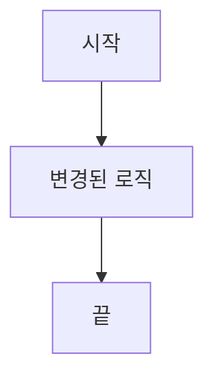

## 📋 개요 (Summary)

<!-- 변경 사항을 한 줄로 요약해 주세요. 전체적인 방향성만 명시하면 됩니다. -->

---

## 💡 변경 배경 (Motivation)

<!-- 왜 이 작업이 필요했나요? 당시의 고충을 생생하게 기록해 주세요.
     맥락 상실을 막는 가장 중요한 섹션입니다. -->

**해결하려는 문제:**

**관련 이슈 / ADR:**

- Issue: #
- ADR: `docs/architecture/decisions/`

---

## 🔧 주요 변경점 (Key Changes)

<!-- 코드 수준에서의 주요 수정 사항을 기술적으로 요약해 주세요.
     나중에 코드 리뷰를 대신하는 느낌으로 작성합니다. -->

-
-
- ***

## 🏗️ 설계 결정 사항 (Design Decisions)

<!-- 대안이 있었다면 왜 이 방법을 선택했는지 간략히 적어주세요.
     규모가 크다면 별도 ADR 작성 후 링크를 남기세요. -->

| 고려한 대안 | 선택한 방법 | 선택 이유 |
| ----------- | ----------- | --------- |
|             |             |           |

> ⚠️ **트레이드오프:** <!-- 이 결정으로 감수한 단점이나 미래 리스크가 있다면 기록해 두세요. -->

---

## 📊 다이어그램 (Diagrams)

<!-- 로직 흐름, 데이터 모델, 서비스 간 통신이 변경되었다면 Mermaid 다이어그램을 추가하세요.
     GitHub에서 자동으로 렌더링됩니다. 해당 없으면 섹션을 삭제하세요. -->

---

## ✅ 검증 결과 (Verification)

<!-- "정상 작동함"을 증명하는 데이터를 남겨주세요. -->

**수행한 테스트:**

- [ ] 단위 테스트 (Unit Test)
- [ ] 통합 테스트 (Integration Test)
- [ ] 수동 테스트 (Manual Test)

**테스트 결과 / 스크린샷:**

<!-- UI 변경이 있다면 Before / After 스크린샷 또는 GIF를 반드시 첨부해 주세요. -->

| Before | After |
| ------ | ----- |
|        |       |

---

## 🗂️ 셀프 체크리스트 (Self-Review Checklist)

<!-- 머지 전 반드시 모든 항목을 확인하세요. -->

**기능적 완성도**

- [ ] 원래 요구사항을 충족하는가?
- [ ] Null, 빈 배열 등 엣지 케이스를 처리했는가?

**코드 품질**

- [ ] 변수명·함수명이 의도를 명확히 드러내는가?
- [ ] 복잡한 로직에 설명 주석을 추가했는가?
- [ ] 불필요한 코드나 디버그 로그를 제거했는가?

**보안 및 견고성**

- [ ] 하드코딩된 비밀값(토큰, 비밀번호)이 없는가?
- [ ] 사용자 입력값이 적절히 검증되는가?

**성능**

- [ ] 불필요한 반복 연산이나 리소스 낭비가 없는가?
- [ ] DB 쿼리가 효율적인가? (N+1 문제 등)

**테스트 및 문서화**

- [ ] 새 기능에 대한 테스트를 추가했는가?
- [ ] README 또는 API 문서에 변경 사항을 반영했는가?
- [ ] 커밋 메시지가 Conventional Commits 규격을 따르는가?
  - `feat`, `fix`, `docs`, `refactor`, `chore` 등

---

## 📝 리뷰어를 위한 메모 (Notes for Future Me)

<!-- 나중에 이 PR을 다시 볼 미래의 나에게 전하고 싶은 말이 있으면 자유롭게 적어주세요.
     "왜 이렇게 구현했는지", "다음에 건드릴 때 주의할 점" 등 -->
