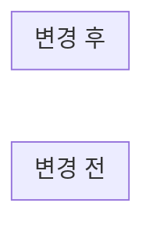

<!-- 코드보다 의도를 먼저 읽게 하는 본문. 1번부터 5번까지 순서대로 채운다.
     리뷰어는 1·2번을 읽고 방향에 동의되면 3번 이하로 내려간다.
     해당 없는 항목은 "없음"이라 적고 섹션 자체는 지우지 않는다.
     develop → main 릴리스 PR은 이 템플릿 대신 ?template=release.md 를 쓴다. -->

**Task ID** `<slug>` · **Exec Plan** `docs/exec-plans/active/<YYYY-MM-DD>-<slug>.md` · **ADR** 없음 / `docs/decisions/…`
**tech debt** `docs/tech-debt/active.md#<섹션>` / 없음 · **Issue** #

## 1. 문제

<!-- 왜 이 작업이 필요한가. 기획이 바뀐 것이면 무엇이 바뀌었는지까지. -->

- 기존 동작:
- 무엇이 문제였나:
- 이번 변경으로 달라지는 것:

<!-- 버그 수정이면 아래 둘을 채운다. 아니면 두 줄을 지운다. -->

- 근본 원인: <!-- 증상이 아니라 원인 -->
- 재현: 환경 / 절차 1·2·3 / 기대 동작 / 실제 동작

## 2. 접근

<!-- 코드 설명이 아니라 선택의 이유. 리뷰어가 방향을 이해할 만큼만.
     접근·의사결정은 exec-plan에서 옮겨 적는다 — 구현이 끝난 뒤 지어내지 않는다. -->

| 결정 항목 | 선택 | 선택 이유 | 버린 대안과 버린 이유 |
| --- | --- | --- | --- |
|  |  |  |  |

<!-- 결정이 여럿이면 행을 늘린다. 검토한 대안이 없으면 "검토한 대안 없음"이라 적는다. -->

<!-- 구조가 바뀌었으면 변경 전후를 그린다. 아니면 아래 블록을 지운다. -->

```mermaid
flowchart LR
  subgraph 변경 전
  end
  subgraph 변경 후
  end
```

## 3. 변경 범위

<!-- 파일 나열이 아니라 영역 단위로. 리뷰어가 어디를 볼지 고르게 한다. -->

| 영역 | 바꾼 것 | 대표 경로 |
| --- | --- | --- |
|  |  |  |

- 의도적으로 건드리지 않은 것:
- 사이드 이펙트가 갈 수 있는 곳:
- 먼저 볼 곳: <!-- 리뷰어 진입점 — 경로 또는 흐름 -->

## 4. 검증

- 확인한 시나리오:
- 엣지 케이스:
- 기존 기능에 준 영향:
- 검증에서 드러난 문제와 조치:

<!-- 검증 증적(verify-task 결과·Codex 계획/1차 검증·ADR 판단·남은 warning)은
     위 헤더의 exec-plan 링크에 있다. 여기에 옮겨 적지 않는다. -->

<!-- UI가 바뀌면 아래 표를 채운다. 아니면 통째로 지운다.
     label을 위 행, 이미지를 바로 아래 행에 둔다 — 이미지가 세로로 길면
     같은 행의 텍스트가 묻혀 안 보인다.
     화면이 4개 이상이면 표를 나눠 한 표에 3개까지만 담는다. -->

| (a) 화면 이름 | (b) 화면 이름 | (c) 화면 이름 |
| --- | --- | --- |
| _여기에 드래그&드롭_ | _여기에 드래그&드롭_ | _여기에 드래그&드롭_ |

## 5. 남은 위험

<!-- 여기가 비어 있으면 리뷰어는 다 확인됐다고 읽는다. 짐작이라도 적는다. -->

- 이 변경이 실패하면 터질 곳:
- 확인하지 못한 부분:
- 배포 후 지켜볼 것: <!-- 지표·로그·화면 -->
- 머지 후 할 일: <!-- 시드 데이터·실기기 확인 등. 없으면 "없음" -->
- 롤백: 가능 · 제한 있음 · 불가 — 데이터 영향:
