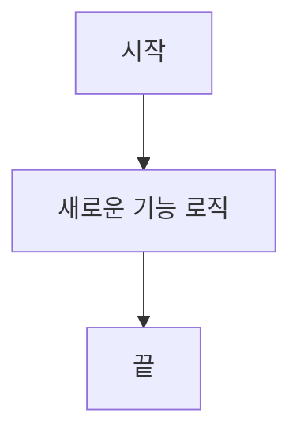

<!-- ✨ Feature 템플릿 — 새로운 기능 추가. ?template=feature.md 로 선택 -->
<!-- PR 제목 형식: [Feat] 명사형으로 작성 -->

## 📋 개요 (Summary)

<!-- 추가한 기능을 한 줄로 요약해 주세요. -->

---

## 🔗 개발 컨텍스트

- **Task ID**: `slug`
- **Exec Plan**: `docs/exec-plans/active/YYYY-MM-DD-slug.md`
- **관련 ADR**: `docs/decisions/NNNN-slug.md` / 해당 없음
- **관련 tech debt**: [docs/tech-debt-tracker.md](docs/tech-debt-tracker.md) / 해당 없음
- **작업 범위**: <!-- 포함한 것 -->
- **제외한 범위**: <!-- 의도적으로 뺀 것 -->

---

## 💡 변경 배경 (Motivation)

<!-- 왜 이 기능이 필요했나요? 당시의 고충을 생생하게 기록해 주세요.
     맥락 상실을 막는 가장 중요한 섹션입니다. -->

**해결하려는 문제:**

**관련 이슈:**

- Issue: #

---

## 🔧 주요 변경점 (Key Changes)

<!-- 코드 수준에서의 주요 수정 사항을 기술적으로 요약해 주세요. (권장 200라인 이하)
     나중에 코드 리뷰를 대신하는 느낌으로 작성합니다. -->

-
-
-

---

## 🏗️ 의사 결정 기록 (Design Decisions)

<!-- 대안이 있었다면 왜 이 방법을 선택했는지 기록해 주세요.
     규모가 크다면 별도 ADR 작성 후 개발 컨텍스트에 링크를 남기세요. -->

| 결정 항목 | 선택 | 선택 이유 | 제외한 대안 / 버린 이유 |
| --------- | ---- | --------- | ----------------------- |
|           |      |           |                         |

> ⚠️ **트레이드오프:** <!-- 이 결정으로 감수한 단점이나 미래 리스크가 있다면 기록해 두세요. -->

---

## 📊 다이어그램 (Diagrams)

<!-- 로직 흐름, 데이터 모델, 서비스 간 통신이 변경되었다면 Mermaid 다이어그램을 추가하세요.
     해당 없으면 섹션을 삭제하세요. -->

---

## ✅ 하네스 검증 (Harness Verification)

| 항목 | 결과 |
| ---- | ---- |
| N/A 사용 여부 | 없음 / 있음: <사유> |
| `verify-task` | `node scripts/verify-task.mjs <task-id>` — PASS / FAIL, RUN_ID=`...`, HEAD=`<sha>`, failed=0, warned=Knip |
| `harness-gate` | `node scripts/harness-gate.mjs <task-id>` — PASS / N/A |
| Codex 계획 검증 | PASS / CHANGE_REQUEST(반영 링크) / BLOCK(머지 불가) / N/A |
| Codex 1차 검증 | PASS / FIX_APPLIED / N/A |
| Claude 2차 검증 | 완료 / N/A |
| ADR 판단 | 불필요 / `docs/decisions/NNNN-slug.md` |
| 남은 warning | 기존 부채 (ESLint N건 / Knip) / 없음 |

---

## 🗂️ 셀프 체크리스트 (Self-Review Checklist)

**기능적 완성도**

- [ ] 요구사항 전체 충족 여부
- [ ] Null, 빈 배열 등 엣지 케이스 처리 여부

**코드 품질**

- [ ] 변수명·함수명의 의도 명확성
- [ ] 불필요한 코드·디버그 로그 제거 여부

**보안 및 견고성**

- [ ] 하드코딩된 비밀값(토큰, 비밀번호) 미포함 확인
- [ ] 사용자 입력값 적절한 검증 여부

---

## 👀 PM / 리뷰어 확인 포인트

- **사용자에게 달라지는 점**: <!-- UI·기능 변경 없으면 "없음" -->
- **운영 / 릴리스 주의사항**: <!-- 환경변수, 마이그레이션, 배포 순서 등 -->
- **롤백 시 영향**: <!-- 없으면 "없음" -->
- **먼저 볼 화면 / 흐름**: <!-- 스크린샷 또는 경로 -->

---

## 📝 리뷰어를 위한 메모 (Notes for Future Me)

<!-- "왜 이렇게 구현했는지", "다음에 건드릴 때 주의할 점" 등 -->
