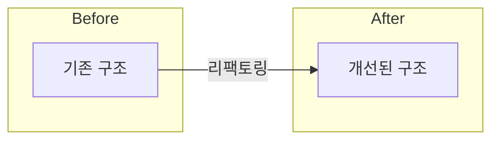

## 📋 개요 (Summary)
<!-- 리팩토링한 내용을 한 줄로 요약해 주세요. -->

---

## 💡 리팩토링 배경 (Motivation)
<!-- 왜 지금 이 코드를 리팩토링해야 했나요?
     단순 "코드 정리"가 아닌, 구체적인 문제 상황을 기록해 주세요. -->

**개선하려는 문제:**
- [ ] 가독성 저하 (복잡도 증가, 네이밍 불명확 등)
- [ ] 중복 코드 (DRY 원칙 위반)
- [ ] 성능 병목
- [ ] 유지보수 난이도 증가
- [ ] 기술 부채 해소
- [ ] 기타:

**관련 이슈 / ADR:**
- Issue: #
- ADR: `docs/architecture/decisions/`

---

## 🔧 주요 변경점 (Key Changes)
<!-- 구조적으로 무엇이 달라졌는지 기술적으로 요약해 주세요. (권장 200라인 이하)
     기능은 동일하게 유지되어야 합니다. -->

-
-
-

---

## 🏗️ 설계 변경 사항 (Design Changes)
<!-- 아키텍처·구조 관점에서 달라진 점을 기록해 주세요. -->

**변경 전 구조:**
<!-- 간략히 설명 또는 Mermaid 다이어그램 -->

**변경 후 구조:**
<!-- 간략히 설명 또는 Mermaid 다이어그램 -->

> ⚠️ **주의사항:** <!-- 이 리팩토링으로 인해 향후 확장 시 고려해야 할 사항 -->

---

## 📊 개선 지표 (Improvement Metrics)
<!-- 정량적으로 측정할 수 있다면 기록해 주세요.
     수치가 없어도 정성적 개선 효과를 기술할 수 있습니다. -->

| 항목 | Before | After |
|------|--------|-------|
| 코드 라인 수 | | |
| 중복 코드 | | |
| 함수 복잡도 | | |
| 기타 | | |

---

## ✅ 검증 결과 (Verification)
<!-- 기능 동작이 변경 전과 동일함을 증명해 주세요. -->

**회귀 테스트 (Regression Test):**
- [ ] 기존 테스트 전체 통과 여부
- [ ] 새로 추가한 테스트 통과 여부
- [ ] 수동 테스트로 주요 시나리오 동작 확인

**수행한 테스트:**
- [ ] 단위 테스트 (Unit Test)
- [ ] 통합 테스트 (Integration Test)
- [ ] 수동 테스트 (Manual Test)

---

## 🗂️ 셀프 체크리스트 (Self-Review Checklist)

**리팩토링 완성도**
- [ ] 외부 동작(기능, API 인터페이스) 변경 없음 확인
- [ ] 기존 테스트 전체 통과 여부
- [ ] 성능 저하 없음 확인 (개선이 목적인 경우 지표 포함)

**코드 품질**
- [ ] 변수명·함수명의 의도 명확성
- [ ] 복잡한 로직 설명 주석 추가 여부
- [ ] 불필요한 코드·디버그 로그 제거 여부
- [ ] 불필요한 기능 변경 미포함 확인 (리팩토링과 기능 개발 분리)

**테스트 및 문서화**
- [ ] 구조 변경에 따른 README·주석 업데이트 여부
- [ ] Conventional Commits 규격 준수 여부 (`refactor`)

---

## 📝 리뷰어를 위한 메모 (Notes for Future Me)
<!-- 이 구조를 선택한 이유, 추가로 개선할 여지가 있는 부분 등 -->
